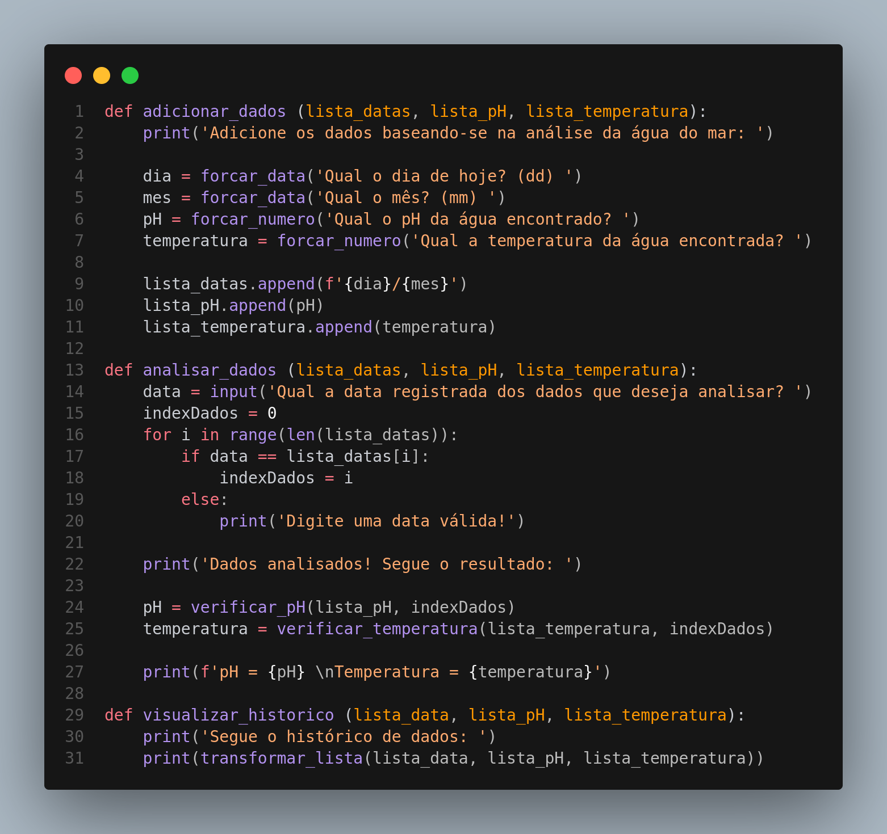
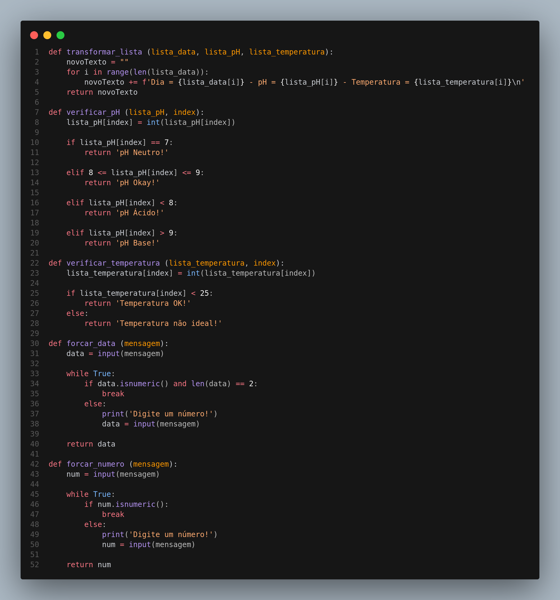
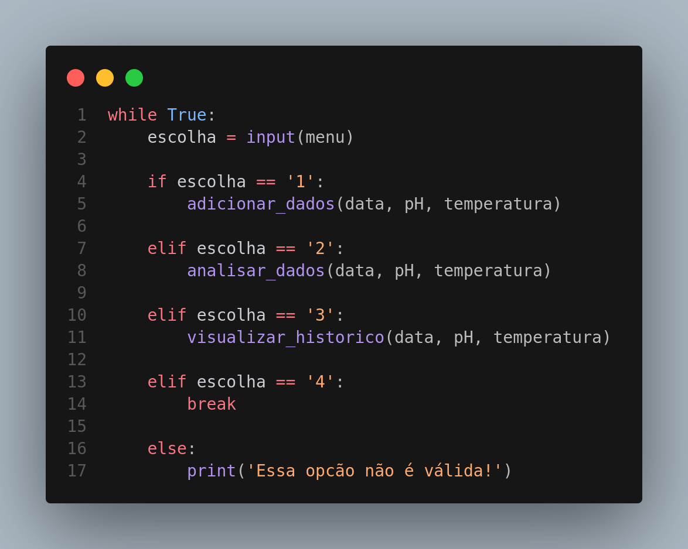

# Global Solution - Python Script  🌊</>

## Alunos 👤 
- André Nakamatsu Rocha: RM555004
- Caio Suzano Ferreira da Silva: RM 554763 
- Lucas Vasquez Silva: RM 555159

# Explicação 💻 
O programa consiste em uma espécie de banco de dados para armazenar, analisar e verificar o histórico dos dados coletados com nosso sistema usando o Arduino. 

### Requisitos
- Python 3.12
- Editor de código qualquer para rodar o script

# O Código 📄 

## Menu e Listas
Primeiro determinamos o menu e as listas para armazenar os dados.

## Funcões Principais
Criamos as funções principais para rodar o código

## Funcões de Apoio
Criamos as funções de apoio para usarmos com tratamento de código e etc...

## Loop
Por fim, criamos um loop para o programa rodar corretamente:
